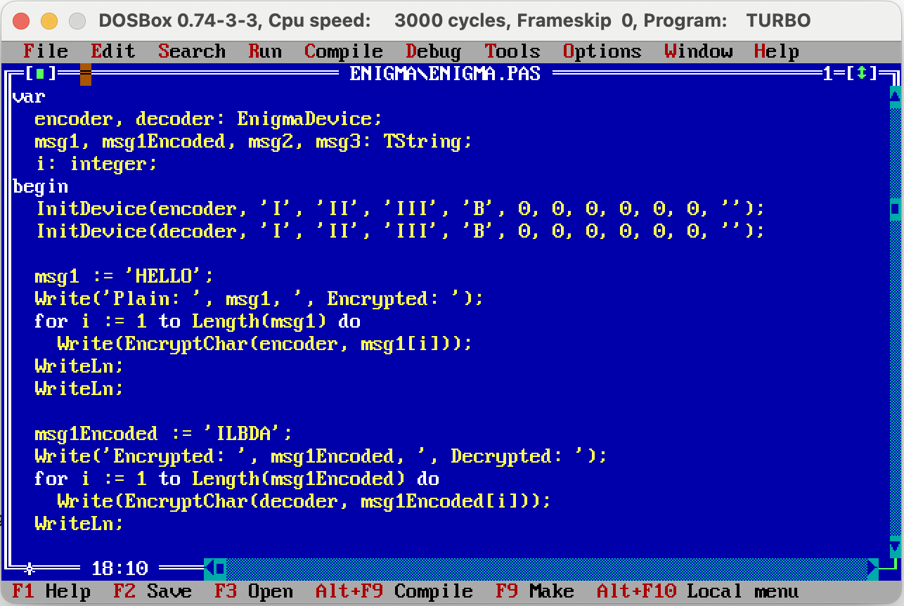

# Enigma on Pascal 3.0

<center>
    
</center>

The ultimate goal of the project is to implement [Enigma Machine](https://en.wikipedia.org/wiki/Enigma_machine) on Pascal 3.0 so that 
such code can be compiled and run on CP/M, ZX Spectrum.

As it isn't easy to run CP/M nowadays, the code is implemented using Borland Pascal 7.0 editor, but with Turbo Pascal 3.0 syntaxis.

## Building

To compile and run, first download Borland Pascal 7.0
```
cd ~/Downloads
wget https://archive.org/download/turbopascal7.0/TP70.zip
unzip TP70.zip -d ./TP70
```

Run DosBox
```
brew install dosbox
dosbox

Z:\> MOUNT C ~/Downloads/TP70
Z:\> C:
C:\> TURBO.EXE
```

Open `ENIGMA.PAS`

<center>
    
</center>
